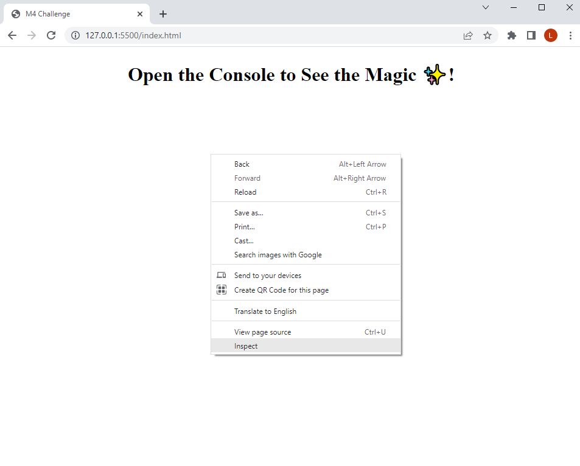

# Bootcamp Module 4 Challenge - Console-Finances
## Description
In this project we start to use JavaScript basics. The end result is displayed in the console, so please use the browser's developer tools to see the results.

## Tasks
My task is to write JavaScript code that analyzes the records to calculate each of the following:
* The total number of months included in the dataset.
* The net total amount of Profit/Losses over the entire period.
* The average of the **changes** in Profit/Losses over the entire period.
    * I need to track what the total change in profits is from month to month and then find the average.
    * The Equation for that is: ```Total/(Number of months - 1)```
 * The greatest increase in profits (date and amount) over the entire period.
 * The greatest decrease in losses (date and amount) over the entire period.


## Live URL
TODO

## Usage
The screenshots below was taken from Chrome, but Firefox and Edge works the same.

1. Browse the index.html
2. Right click on the body area, and select Inspect 



3. The Developer Tools shows up.


4. Click on Console. Here you can see the results.


## Mock-up
The expected output is:

```
Financial Analysis
----------------------------
Total Months: 86
Total: $38382578
Average Change: -2315.12
Greatest Increase in Profits/Losses: Feb-2012 ($1926159)
Greatest Decrease in Profits/Losses: Sep-2013 ($-2196167)
```

